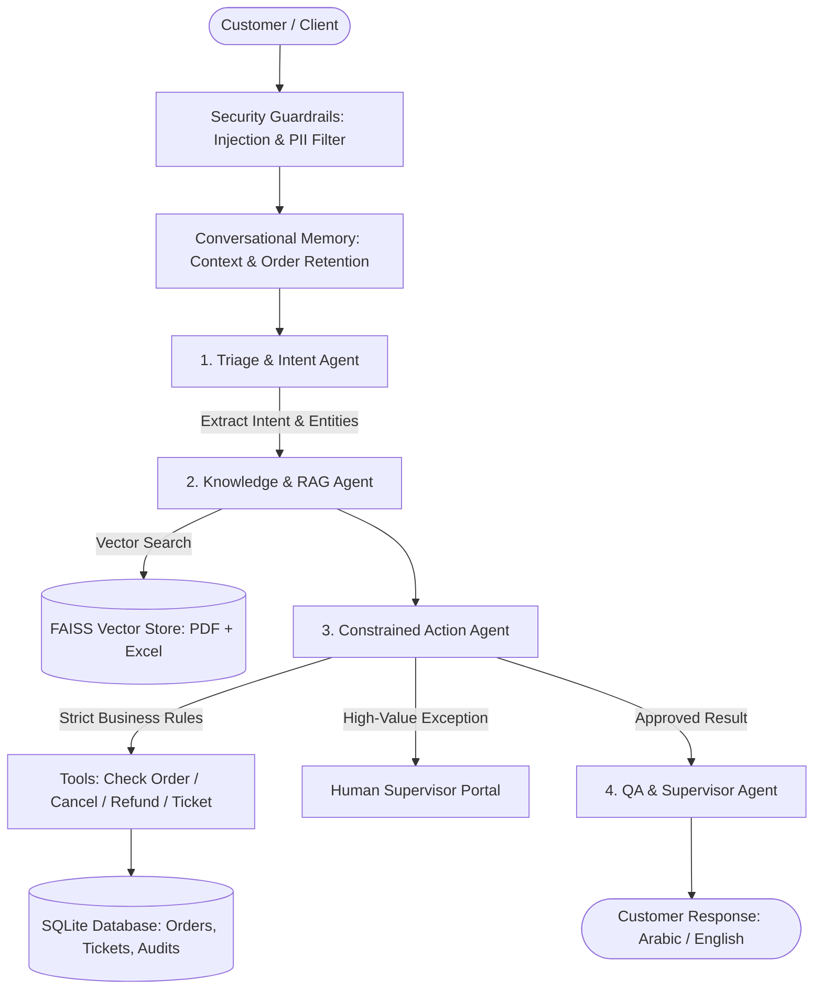

# 🛡️ Autonomous Customer Operations & Support Hub (OpsHub AI)
> **An Enterprise Multi-Agent AI System with RAG, Tool Execution, Conversational Memory, Strict Guardrails, and Human-in-the-Loop Operations.**

---

## 📌 1. Real-World Problem & Solution
* **The Problem:** Modern e-commerce and tech companies drown in support tickets. Traditional chatbots fail because they can only output static text, while unrestricted AI agents are dangerous because they hallucinate policies and issue unauthorized refunds.
* **The Solution:** A strictly constrained, multi-agent autonomous system where:
  * Inquiries are classified and triaged by a **Triage Agent**.
  * Ground truth is retrieved from verified company policies (PDF) and product inventory (Excel) by a **Knowledge/RAG Agent**.
  * Operations (order lookups, cancellations, refunds) are handled by a **Constrained Action Agent** bounded by strict financial ceilings and confirmation rules.
  * Any high-risk or high-value action ($ > $150) automatically escalates to a **Human Supervisor** via a ticket queue.
  * Responses are synthesized and tone-checked by a **QA / Supervisor Agent**.

---

## 🏛️ 2. System Architecture



---


## 🚀 4. How to Run the System

### 1. Run Automated Test Verification
Verify the entire pipeline, database, RAG vector store, and guardrails:
```bash
python run_system.py --test
```

### 2. Launch the Web Interface (Streamlit)
Start the dual-mode portal (Customer Chat + Supervisor Operations Dashboard):
```bash
python run_system.py --ui
```
* Or directly:
```bash
streamlit run web_ui/app_ui.py
```

### 3. Launch the Backend REST API (FastAPI)
Run the production API with interactive Swagger docs:
```bash
python run_system.py --api
```
* Access interactive API documentation at: `http://127.0.0.1:8000/docs`

---

## 🛡️ 5. Key Operational Guardrails
1. **Irreversible Action Confirmation:** Orders in `Processing` cannot be cancelled by accident; the agent requires explicit customer confirmation.
2. **Autonomous Refund Ceiling:** Automated refunds are capped at **$150.00 USD**. Any refund above $150 or outside the standard return window is immediately converted into a `Pending_Human_Approval` ticket.
3. **Anti-Prompt Injection:** Malicious inputs attempting to override rules or extract system prompts are rejected immediately at the perimeter.
4. **Audit Trail:** Every agent action and human supervisor decision is permanently logged in the SQLite `audit_logs` table.
